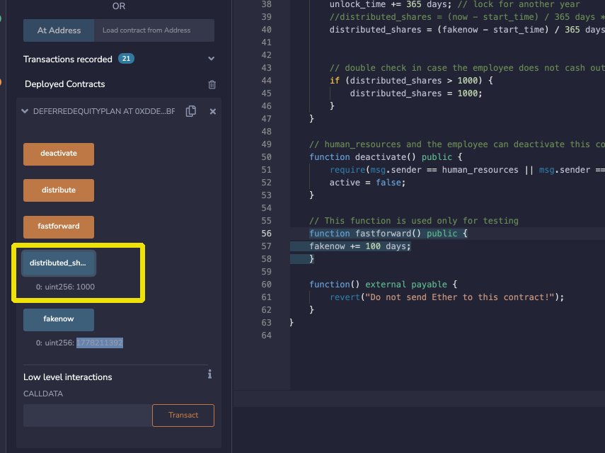

# Smart Contracts 

Implemented 3 smart Contracts in Solidity using Remix IDE and Metamask to connect t Ganache.

`AssociateProfitSplitter` smart contract

`TieredProfitSplitter` smart contract

`DeferredEquityPlan` smart contract

## `AssociateProfitSplitter` contract

Implemented an`AssociateProfitSplitter` contract. This will accept Ether into the contract and divide the Ether evenly among the associate level employees. This will allow the Human Resources department to pay employees quickly and efficiently.

Written in Solidity and deployed on Ganache.

Executed Functions of contract on Remix IDE.

### Remix IDE / Solidity Contract code

[Solidity code- AssociateProfitSplitter.sol](https://gist.github.com/rchak007/b657bbab479359f0b83268dce6e451e5)

### Ganache/Remix screeshots

Intial balances on Ganache.

in Blue is from where we will Deploy and also Deposit. the 3 accounts are in RED which are set when deployinig through the Constructor.

Initial contract creation:

Now depositing 4 Ether. So 2 accounts got 1.33 each but one got 1.34.

Accounts now reflect the balances 4/3 = 1.33

## `TieredProfitSplitter` contract

Implemented an `TieredProfitSplitter` smart contract that will distribute different percentages of incoming Ether to employees at different tiers/levels. For example, the CEO gets paid 60%, CTO 25%, and Bob gets 15%.

### Remix IDE / Solidity Contract code

https://gist.github.com/rchak007/02b8818c5685e7b6974b793de885d1b2

### Deploy/testing screenshots

Here Account 2 in RED deploys the contract and we include 3 other accounts for CEO, CTO and Bob in Blue for tiered % distribution. (for convenience of testing we use it under the same Nmemonic addresses)

We successfully deployed on Ganache

we now deposit 1 ETH

## `DeferredEquityPlan` smart contract

Implemented a `DeferredEquityPlan` smart contract that models traditional company stock plans. This contract will automatically manage 1000 shares with an annual distribution of 250 over 4 years for a single employee.

We don't work with Ether in this contract, but we will be storing and setting amounts that represent the number of distributed shares the employee owns and enforcing the vetting periods automatically.

**A two-minute primer on deferred equity incentive plans:** In this set-up, employees receive shares for joining and staying with the firm. They may receive, for example, an award of 1,000 shares when joining, but with a 4 year vesting period for these shares. This means that these shares would stay with the company, with only 250 shares (1,000/4) actually distributed to and owned by the employee each year. If the employee leaves within the first 4 years, he or she would forfeit ownership of any remaining (“unvested”) shares.

* If, for example, the employee only sticks around for the first two years before moving on, the employee’s account will end up with 500 shares (250 shares * 2 years), with the remaining 500 shares staying with the company. In this above example, only half of the shares (and any distributions of company profit associated with them) actually “vested”, or became fully owned by the employee. The remaining half, which were still “deferred” or “unvested”, ended up fully owned by the company since the employee left midway through the incentive/vesting period.

* Specific vesting periods, the dollar/crypto value of shares awarded, and the percentage equity stake (the percentage ownership of the company) all tend to vary according to the company, the specialized skills, or seniority of the employee, and the negotiating positions of the employee/company. If you receive an offer from a company offering equity (which is great!), just make sure you can clarify the current dollar value of those shares being offered (based on, perhaps, valuation implied by the most recent outside funding round). In other words, don’t be content with just receiving “X” number of shares without having a credible sense of what amount of dollars that “X” number represents. Be sure to understand your vesting schedule as well, particularly if you think you may not stick around for an extended period of time.

### Remix IDE / Solidity Contract code

https://gist.github.com/rchak007/4b05428c9935c18cfaea288332d69afe

### Testing Metamask/Remix/Kovan Testnet

we will deploy on Kovan testnet no this one.

Human Resurces address (in RED):

0x15D5eC9D3F67A42f1D56E205a79ae6931F50A431

Employee Address in Yellow:

0xAB4A0C2ed939f32DE20E7118E23fddaF9739aCe0

Deployment:

Contract address - 0xDdE599308176f23CCF7CAF1b40E8B6640e6bf0d3

can be viewed on Etherscan.io Koran testnet

https://kovan.etherscan.io/address/0xDdE599308176f23CCF7CAF1b40E8B6640e6bf0d3

https://www.unixtimestamp.com

after deploying contract we check the current date/time by using public variable 'fakenow'

We now hit fast forward 4 times since it advances the fakenow by 100 days  so we are over 1 year.

You will also pay gas each time you Fast forward as its function. But this is only in test environment.

Now we are over a year. 
So we can distribute 250 shares.

Now we fast forward full 5 yrs.

Below is also the transactions we did from Remix on Etherscan Kovan testnet. 

