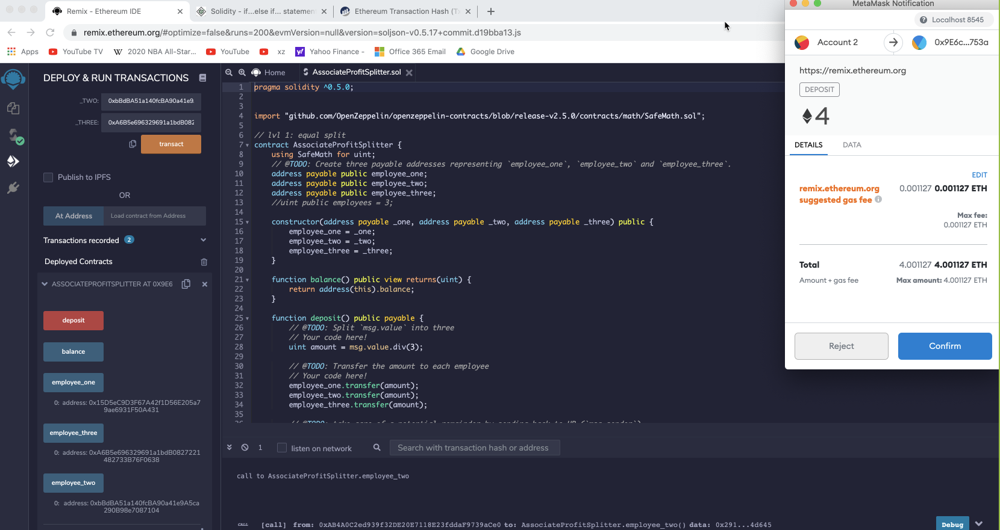

# Smart Contracts 

Implemented 2 smart Contracts in Solidity using Remix IDE and Metamask to connect t Ganache.

`AssociateProfitSplitter` smart contract and

`TieredProfitSplitter` smart contract

## `AssociateProfitSplitter` contract

Implemented an`AssociateProfitSplitter` contract. This will accept Ether into the contract and divide the Ether evenly among the associate level employees. This will allow the Human Resources department to pay employees quickly and efficiently.

Written in Solidity and deployed on Ganache.

Executed Functions of contract on Remix IDE.

### Remix IDE / Solidity Contract code

[Solidity code- AssociateProfitSplitter.sol](https://gist.github.com/rchak007/b657bbab479359f0b83268dce6e451e5)

### Ganache/Remix screeshots

Intial balances on Ganache.

in Blue is from where we will Deploy and also Deposit. the 3 accounts are in RED which are set when deployinig through the Constructor.

Initial contract creation:

Now depositing 4 Ether. So 2 accounts got 1.33 each but one got 1.34.

Accounts now reflect the balances 4/3 = 1.33

## `TieredProfitSplitter` contract

Implemented an `TieredProfitSplitter` smart contract that will distribute different percentages of incoming Ether to employees at different tiers/levels. For example, the CEO gets paid 60%, CTO 25%, and Bob gets 15%.

### Deploy/testing screenshots

Here Account 2 in RED deploys the contract and we include 3 other accounts for CEO, CTO and Bob in Blue for tiered % distribution. (for convenience of testing we use it under the same Nmemonic addresses)

We successfully deployed on Ganache

we now deposit 1 ETH

