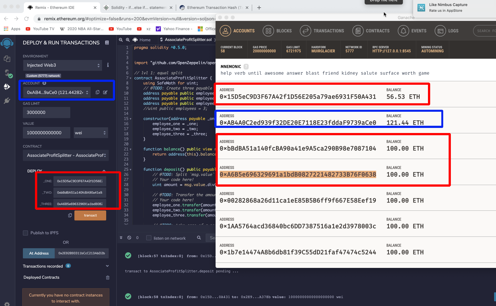
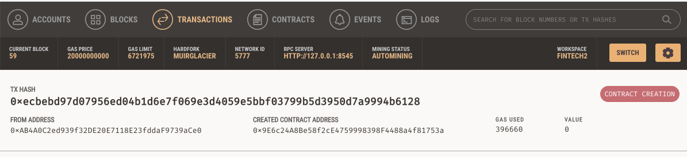
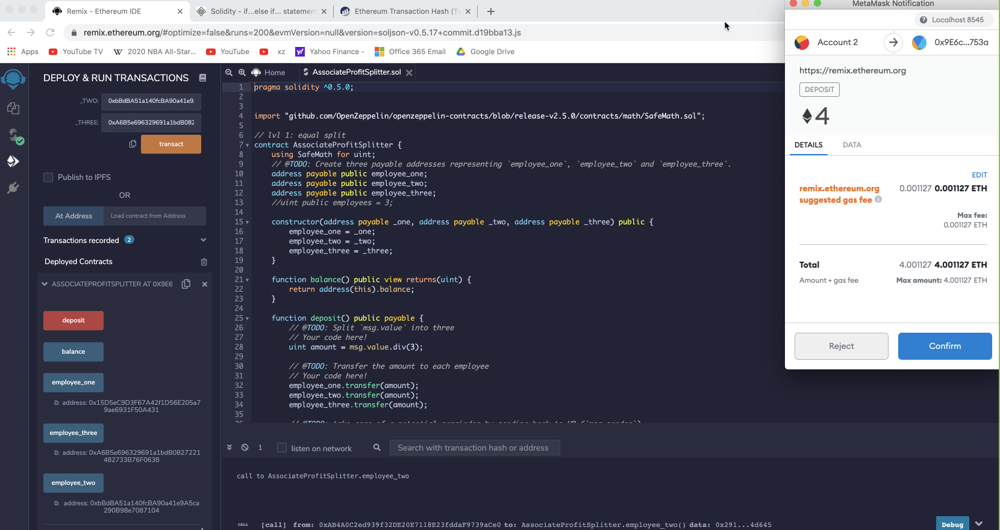
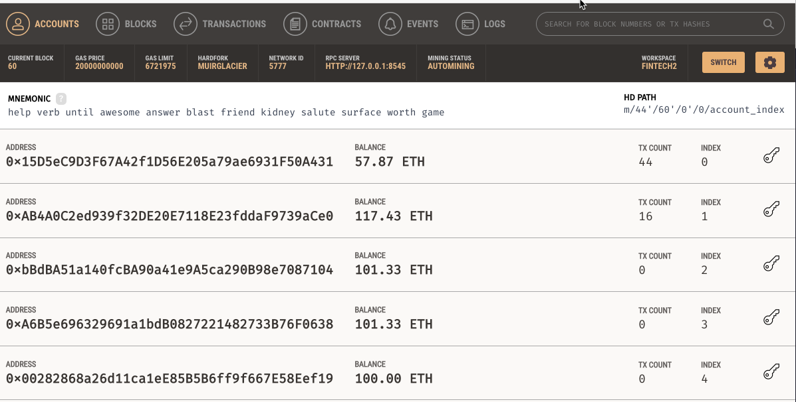

Solidity code:

[Solidity code- AssociateProfitSplitter.sol](https://gist.github.com/rchak007/b657bbab479359f0b83268dce6e451e5)

Intial balances on Ganache.

in Blue is from where we will Deploy and also Deposit. the 3 accounts are in RED which are set when deployinig through the Constructor.

Initial contract creation:

Now depositing 4 Ether. So 2 accounts got 1.33 each but one got 1.34.

Accounts now reflect the balances 4/3 = 1.33

